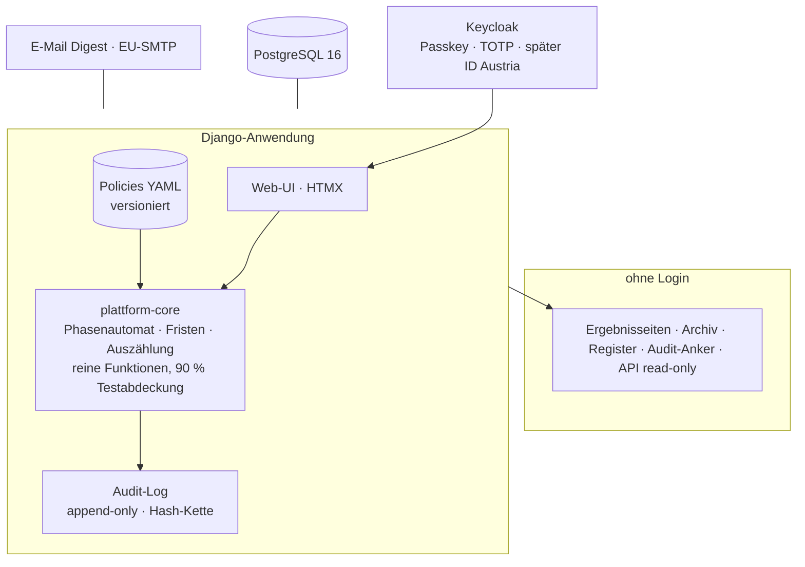

# ParlamentPlattform — Lastenheft und technisches Konzept

**Version 0.1 — 19. August 2026**
**Status: Entwurf zur Entscheidung. Nach Freigabe wird dieses Dokument die Gründungsdatei des öffentlichen Repositories.**

---

## 0. Zweck dieses Dokuments

Dieses Dokument beantwortet drei Fragen: *Wie* bauen wir die ParlamentPlattform (Vorgehen), *was genau* muss sie können (Lastenheft), und *womit* bauen wir sie (Technologie). Es ist so geschrieben, dass es unverändert als `docs/CONCEPT.md` ins öffentliche Repository wandern kann — denn bei der DDÖ ist die Entstehung des Werkzeugs Teil des Werkzeugs.

Jede funktionale Anforderung trägt eine Referenz auf den Satzungsentwurf 2.1 (z. B. *→ § 5 Abs 5*). Die Satzung ist das Pflichtenheft des Verfahrens; diese Datei übersetzt sie in Software.

---

## 1. Sieben Leitplanken, aus denen alles folgt

Bevor über Frameworks geredet wird, die Grundsätze. Sie stammen aus der Satzung und aus der Auswertung von rund 25 Vorgängerprojekten weltweit — und sie entscheiden mehr über die Architektur als jede Technologiewahl.

**L1 — Nachrechenbar ohne Spezialkenntnisse (→ § 5 Abs 8).** Jedes Abstimmungsergebnis muss von einem Mitglied ohne Informatikstudium überprüfbar sein. Konsequenz: Der Auszählungskern ist ein kleines, lesbares, deterministisches Programm mit veröffentlichten Eingabedaten — kein kryptografisches Kunstwerk, das man glauben muss. Die deutschen LiquidFeedback-Entwickler haben 2012 den entscheidenden Satz formuliert: Geheime Online-Abstimmung und Überprüfbarkeit durch die Teilnehmer schließen einander aus. Wir wählen die Überprüfbarkeit und sagen das offen.

**L2 — Die Regeln frieren ein (→ § 5 Abs 5).** Schwellen, Fristen und Auszählungsregeln eines Antrags werden im Moment der Einbringung festgeschrieben und als Kopie am Antrag gespeichert. Eine spätere Änderung der Verfahrensordnung berührt laufende Verfahren nie. Das ist keine Funktion, das ist ein Datenmodell-Grundsatz.

**L3 — Niemand kuratiert im Verborgenen (→ § 2 Abs 6, § 5 Abs 2).** Es gibt keine algorithmische Priorisierung, kein Ranking nach Engagement, keinen Feed. Anträge sortieren sich ausschließlich nach offengelegten, nachrechenbaren Kriterien (Phase, Frist, Unterstützungsstand, Datum). KI darf zusammenfassen und übersetzen — gekennzeichnet, versioniert, abschaltbar, niemals entscheidend.

**L4 — Beteiligung ist der Engpass, nicht Technik.** Die Piraten erreichten unter 3 % Mitgliederbeteiligung, Rousseau nie mehr als ein Drittel der Registrierten. Konsequenz: Die Plattform wird für die Person gebaut, die zweimal im Monat zehn Minuten hat — nicht für den Power-User. Wenige Klicks bis zur Stimme, verständliche Zusammenfassungen, E-Mail-Digest statt Login-Zwang, und keine Pflicht, zu allem eine Meinung zu haben.

**L5 — Offenheit ohne Kaperung (→ § 4 Abs 4).** Ein Konto pro Mensch, geprüfte Identität, Anwartschaftsfristen, automatische Erkennung von Beitrittswellen. Verifikation kommt **vor** Anonymität — das ist seit den KI-Astroturfing-Fällen 2025/26 (20.000 Fake-Mails an eine US-Behörde vor einer einzigen Abstimmung) keine theoretische Sorge mehr.

**L6 — Das System kennt seine Grenzen und zeigt sie (→ § 2 Abs 7, § 5 Abs 11, § 6 Abs 10).** Ein Beschluss, den niemand umsetzt, ist schlimmer als keiner: Er entwertet das Verfahren. Österreichs Klimarat 2022 hat es vorgeführt — 93 Empfehlungen, keine Behandlungspflicht, kaum Wirkung. Konsequenz: Der Durchsatz wird getaktet, der Vollzug berichtet standardisiert zurück, und Überlastung ist ein sichtbarer Systemzustand mit definierter Reaktion — kein Flurfunk. Die Plattform misst ihre eigenen Grenzen und veröffentlicht sie wie jedes andere Ergebnis.

**L7 — Die Zukunftswerkstatt berät alle und regiert niemanden (→ § 2 Abs 6/7, § 5 lit c, § 6 Abs 11).** Die Zukunftswerkstatt — mit der StaatsSimulation als Rechenkern — liefert Einschätzungen mit Quellen und Kontextstand — sie bewertet, priorisiert oder verwirft keine Anträge, sie lenkt keine Aufmerksamkeit und sie ändert keine Regel. Ihre Vorschläge münden in Berichte an den Koordinationsrat und in versioniert beschlossene Verfahrensänderungen; ihre Prognosen werden öffentlich gegen die Wirklichkeit gehalten (Prognose-Register, F-65). Der Demos darf atmen, die Stimme wiegt immer gleich: Zuschnitts-Fragen (wer gehört zum Kreis der Entscheidenden) sind lernbare Parameter — das Stimmgewicht im Kreis ist unantastbar.

**Explizite Nicht-Ziele** (ebenso wichtig): kein staatliches E-Voting und kein Anspruch darauf (→ § 2 Abs 5); keine geheime Online-Personenwahl, solange Geheimheit und Laien-Überprüfbarkeit nicht vereinbar sind — geheime Wahlen laufen per Präsenz/Brief (→ § 13 Abs 3); keine Blockchain (löst kein einziges unserer Probleme, kostet Verständlichkeit); keine Mobile-Apps im ersten Jahr (responsive Web genügt); keine Eigenentwicklung von Krypto-Primitiven, je.

---

## 2. Vorgehen: vier Phasen mit harten Toren

Jede Phase endet mit einem öffentlich überprüfbaren Ergebnis. Keine Phase beginnt, bevor das Tor der vorigen dokumentiert bestanden ist — das diszipliniert uns und ist zugleich unser Marketing: Die Partei, die liefert, bevor sie verspricht.

*(Stand 20.08.2026: Tor der Phase 0 bestanden; Phase 1 läuft — die Plattform ist in der Alpha-Phase unter [parlament.ddoe.at](https://parlament.ddoe.at) öffentlich erreichbar, inklusive Registrierung, Kategorienbaum, Übersichtsseite und Mitgliederverwaltung. Offen für das Phase-1-Tor: der reale Testlauf mit 20–50 Personen.)*

### Phase 0 — Fundament (2 Wochen)
Repository anlegen, Lizenz und Governance festlegen, dieses Dokument einchecken, Architekturentscheidungen als ADRs (Architecture Decision Records) schriftlich begründen, Domänenmodell festziehen, CI-Pipeline mit erstem Test grün.
**Tor:** Öffentliches Repo mit README, CONCEPT, 5 ADRs, laufender CI. Jeder kann `docker compose up` ausführen und sieht eine leere, laufende Plattform.

### Phase 1 — Verfahrenskern / MVP (8 Wochen)
Der vollständige Fünf-Schritte-Weg für **Sachanträge**: einbringen → unterstützen → beraten → abstimmen → veröffentlichen. Identität in Stufe „geprüftes Mitglied" (manuelle Prüfung durch die Partei, technisch: Einladungscode nach Identitätsfeststellung). Keine Gewichtung, keine KI, keine ID Austria — der nackte, korrekte Kern.
**Tor:** Ein realer Testlauf mit 20–50 echten Personen und mindestens 3 vollständigen Antragsdurchläufen. Alle Ergebnisse öffentlich, Auszählung von mindestens einem unbeteiligten Dritten nachgerechnet.

### Phase 2 — Härtung und Betrieb (8–12 Wochen)
Öffentliches Audit-Log mit Hash-Kette, Datenexport, Rechenschaftsregister (→ § 7 Abs 5), Verfahrensordnungs-Editor (Policies versioniert), Offline-Stimmerfassung (→ § 13 Abs 3), E-Mail-Digests, Barrierefreiheits-Durchgang, Penetrationstest durch Externe, DSFA (→ § 8 Abs 3).
**Tor:** Testbetrieb mit 200+ Personen; die erste Fassung der Verfahrensordnung wird **auf der Plattform selbst** beschlossen — das System beschließt seine eigenen Regeln. Veröffentlichter Sicherheitsbericht.

### Phase 3 — Skalierung (ab 2027, laufend)
ID Austria als zusätzlicher Login (OIDC-Anbindung über den Identity-Broker; der Antrag als Service Provider ist der langwierige Teil, nicht der Code), Betroffenheitsgewichtung nach § 5 Abs 6 (erst nach Erprobung in der Simulation), KI-Unterstützung nach § 2 Abs 6 (Zusammenfassungen mit menschlicher Freigabe), Mehrsprachigkeit, externes Sicherheitsaudit nach § 5 Abs 8.

---

## 3. Lastenheft

Priorisierung nach MoSCoW: **M**uss (MVP), **S**oll (Phase 2), **K**ann (Phase 3), **N**icht (bewusst ausgeschlossen).

### 3.1 Identität und Mitgliedschaft

| Nr. | Anforderung | Prio | Satzung |
|---|---|---|---|
| F-01 | Ein Konto je natürlicher Person; Registrierung nur mit Einladungscode, den die Partei nach Identitätsfeststellung vergibt | M | § 2 Abs 4, § 4 Abs 4 lit e |
| F-02 | Login passwortlos per Magic-Link und Passkey (WebAuthn); TOTP als Zweitfaktor optional, für Organrollen verpflichtend | M | § 8 |
| F-03 | Stimmberechtigungs-Logik je Beschlussgegenstand: Anwartschaft 3 Monate (Sachfragen) / 12 Monate (Personen, Satzung), Übergangsregel, Stichtag = Abstimmungsbeginn, Zahl der Stimmberechtigten wird vor jeder Abstimmung veröffentlicht | M | § 4 Abs 4 lit a–d |
| F-04 | Beitrittswellen-Detektor: +25 % und +500 Mitglieder in 30 Tagen → automatische Meldung an Integritätsrat, Ruhen-Mechanik nach Satzung | S | § 4 Abs 4 lit f |
| F-05 | Rollen: Mitglied, Integritätsrat, Koordinationsrat, Systembetrieb — mit minimalen Rechten je Rolle; jede Organaktion ist protokolliert und öffentlich begründet | M | § 6 |
| F-06 | ID-Austria-Login als zusätzliche Identitätsstufe über OIDC | K | § 2 Abs 4 |
| F-07 | Offline-Mitglieder: Erfassung von Präsenz-Identitätsfeststellung, Stimmabgabe auf Papier durch berechtigte Erfasser mit Vier-Augen-Protokoll | S | § 13 Abs 2–3 |
| F-49 | **Menschlichkeitsprüfung bei Registrierung und Anmeldelink (umgesetzt):** vier Lagen ohne Drittanbieter und ohne JavaScript-Pflicht — Honigtopf-Feld, signierte Mindestzeit, Rechenfrage, IP-Drossel je Stunde. Gegen gezielte Angriffe wirkt die Identitätsstufen-Architektur (§ 4) plus Beitrittswellen-Detektor (F-04); kein reCAPTCHA, keine Datenweitergabe | M | § 4, § 8 |

### 3.2 Antragsverfahren (der Kern)

| Nr. | Anforderung | Prio | Satzung |
|---|---|---|---|
| F-10 | Antrag einbringen: Titel, Wortlaut, Begründung; Veröffentlichung im Wortlaut ohne inhaltliche Vorprüfung; Autor wahlweise Klarname oder beständiges Pseudonym | M | § 5 Abs 2–3 |
| F-11 | **Regel-Einfrieren:** Beim Einbringen wird die dann gültige Policy (Schwellen, Fristen, Auszählungsregel) als unveränderliche Kopie am Antrag gespeichert; das System kann laufende Verfahren technisch nicht umkonfigurieren | M | § 5 Abs 5 |
| F-12 | Unterstützungsphase: Unterstützen/Zurückziehen bis Fristende; Fortschritt öffentlich; bei Verfehlen verfällt der Antrag, Wiedereinbringung nach 6 Monaten | M | § 5 Abs 3 lit b |
| F-13 | Beratungsphase ≥ 21 Tage: Kommentare (nur Mitglieder), Stellungnahmen des Expertenrats mit Interessenoffenlegung, Änderung des Antragstexts nur durch Autor mit vollständiger Versionshistorie; abgestimmt wird über die zuletzt veröffentlichte Fassung | M | § 5 Abs 3 lit c |
| F-14 | Dringlichkeitsverfahren: verkürzte Beratung nur bei doppelter Unterstützungsschwelle plus Begründung | S | § 5 Abs 3 lit c |
| F-15 | Abstimmung ≥ 7 Tage: Ja/Nein/Enthaltung; eigene Stimme bis Fristende änderbar; Ergebnis erst nach Fristende sichtbar (kein Bandwagon-Effekt) | M | § 5 Abs 3 lit d |
| F-16 | Beschlussfeststellung: Mehrheit der abgegebenen Stimmen und Mindestbeteiligung ≥ 5 % der Stimmberechtigten, aus der eingefrorenen Policy | M | § 5 Abs 4 |
| F-17 | Zurückweisung (nur offensichtliche Rechtswidrigkeit / § 3-Verstoß / Dublette) ausschließlich durch Integritätsrat, mit veröffentlichter schriftlicher Begründung und Anfechtungshinweis | M | § 5 Abs 2 |
| F-18 | Melde- und Abhilfeverfahren für rechtswidrige Inhalte (DSA Art 16): Meldeknopf, dokumentierte Entscheidung | S | § 5 Abs 2 |
| F-19 | Betroffenheitsgewichtung für Sachfragen als Policy-Option: transparent deklariert, nur nach Verfahrensordnungs-Beschluss aktivierbar, im Ergebnis getrennt ausgewiesen (gewichtet und ungewichtet) | K | § 5 Abs 6 |
| F-70 | **Mandats-Kandidaturen als Anträge (E-2.5):** besondere Antragsart „Mandats-Kandidatur" — jedes wählbare Mitglied kandidiert jederzeit selbst (auch bevor die Partei ein Mandat der Ebene hält) oder beteiligt sich am bestehenden Kandidatur-Antrag und wird im Antragsfenster als wählbar geführt; Zustimmung je Bewerbung, die meiste Zustimmung gewinnt, die Zustimmungsreihenfolge ergibt die Listenreihung des Wahlvorschlags; strikt eine Person, eine Stimme | M | § 7 Abs 1 |
| F-71 | **Mandatar-Steuerung (E-2.5):** öffentliche Mandatare-Seite (Foto, aktuelle Aufgaben, laufende Entscheidungsprozesse samt Fristen) je Mandatsträger; Rolle „Mandatar" mit Instant-Reports und den daraus entstehenden, vom Mandatar betreuten Abstimmungen; Informationspflicht aus der Mandatsvereinbarung; Ergebnisse als Beschlusslage und Richtschnur, freies Mandat unberührt | M | § 7 Abs 2, 3, 5, 9 |

### 3.3 Veröffentlichung, Nachvollziehbarkeit, Register

| Nr. | Anforderung | Prio | Satzung |
|---|---|---|---|
| F-20 | Permanente öffentliche Ergebnisseite je Antrag: Wortlaut aller Fassungen, Verlauf, Ergebnis, Beteiligung, eingefrorene Policy — ohne Login lesbar | M | § 5 Abs 3 lit e |
| F-21 | **Nachrechenbarkeit:** Zu jeder Abstimmung werden veröffentlicht: anonymisierte Stimmliste (Pseudonym-IDs), Auszählungsskript, Ergebnis. Jeder kann das Skript lokal ausführen und das Ergebnis reproduzieren. Jedes Mitglied kann per persönlichem Prüfcode verifizieren, dass die eigene Stimme korrekt in der Liste steht | M | § 5 Abs 8 |
| F-22 | Append-only-Audit-Log aller verfahrensrelevanten Ereignisse mit Hash-Kette; der aktuelle Kettenkopf wird täglich öffentlich publiziert (Website + Repo), sodass nachträgliche Manipulation erkennbar wäre | S | § 5 Abs 8 |
| F-23 | Offener Datenzugang: JSON/CSV-Export je Verfahren, öffentliche Read-only-API | S | § 8 Abs 1 |
| F-24 | **Rechenschaftsregister:** je Parlamentsabstimmung Beschluss der Plattform, tatsächliche Stimme, Begründung des Mandatars, Zeitstempel ≤ 7 Tage, dauerhaft, filterbar | S | § 7 Abs 5 |
| F-25 | Kein personenbezogenes Stimmverhalten öffentlich; Klarnamen-Zuordnung der Pseudonyme nur intern, zugriffsbeschränkt, protokolliert | M | § 8 Abs 5 |

### 3.4 Assistenz beim Einbringen und Beitritt (Ergänzung 19.08.2026)

| Nr. | Anforderung | Prio | Satzung |
|---|---|---|---|
| F-35 | **Ähnlichkeitshinweis beim Einbringen:** Vor der Veröffentlichung zeigt das System die drei ähnlichsten offenen Anträge mit nachrechenbarem Score und der Option, stattdessen zu unterstützen. „Trotzdem einbringen" ist stets gleichwertig möglich — der Hinweis blockiert nie (ADR-006, Stufe 1 lexikalisch, Stufe 2 semantisch lokal) | M | § 2 Abs 6 |
| F-36 | **Normbezüge und Folgenabschätzung:** Anzeige, welche bestehenden Normen ein Antrag berührt (RIS-Abgleich) und was die StaatsSimulation berechnet — als gekennzeichnete Modellrechnung mit Annahmen, ohne Bindungswirkung (ADR-006, Stufe 3) | K | § 6 Abs 4 |
| F-37 | **Selbstregistrierung:** Formular auf Plattform und ddoe.at (Name, E-Mail, Geburtsjahr, Wohnsitz-Gemeinde), Double-Opt-in per E-Mail, danach sofort Zugang als **Anwärter** (lesen, erkunden); Mitgliedsrechte nach Bestätigung durch den Koordinationsrat, Stimmrechte nach Anwartschaft | M | § 4 Abs 1, Abs 4 |
| F-38 | **Beitragsreferenz:** Nach Registrierung persönlicher Verwendungszweck für die Beitragsüberweisung; Zahlungsdienstleister-Integration später als eigene Ausbaustufe mit PartG-konformer Dokumentation | S | § 4 Abs 3 |
| F-39 | **ID-Austria-Pflichtlogin (später):** Sobald verfügbar, ersetzt die ID-Austria-Anmeldung Benutzername/Passwort bzw. Magic-Link bei jedem Einstieg; technisch als Identity-Broker-Umschaltung vorbereitet, keine Architekturänderung | K | § 2 Abs 4 |
| F-53 | **Einführung nach der Bestätigung (umgesetzt):** Wer den Bestätigungslink klickt, landet in einer geführten, bebilderten Einführung mit Fortschrittsleiste — 1. Lebensbereiche finden (die vier Säulen samt Suche, Favoriten mit Ast-Wirkung), 2. die erste Abstimmung verstehen (Pseudonym, Prüfcode, Fristen, an einer echten laufenden Abstimmung), 3. einen Antrag einbringen lernen (Ähnlichkeitshinweis, Verfahrensweg); Abschluss ist der Mitgliedsbeitrag (QR). Jeder Schritt ist überspringbar — nichts wird erzwungen (§ 2 Abs 6); zweisprachig, ohne JavaScript | S | § 2 Abs 6, § 13 Abs 4 |

**Das Hauptfenster in vier Bereichen** (Leitgestalt aus Satzung 1.3, Technischer Entwicklungsrat; verankert als § 5 Abs 10 des Satzungsentwurfs 2.2):

| Nr. | Anforderung | Prio | Satzung |
|---|---|---|---|
| F-40 | **Vier-Bereiche-Hauptfenster:** Die Startseite gliedert sich in a) Favoriten, b) hervorgehobene Abstimmungen, c) regional, d) Anträge & Gesetzesvorschläge. Reihung innerhalb der Bereiche ausschließlich nach Phase und Frist (F-31 gilt fort) | M | § 5 Abs 10 |
| F-41 | **Favoriten (Bereich a):** Jedes Mitglied merkt sich Themen; laufende Abstimmungen der eigenen Favoriten erscheinen zuerst. Favoriten sind rein persönlich und wirken nie auf Reihung, Schwellen oder Ergebnis | M | § 5 Abs 10 lit a |
| F-42 | **Hervorhebung (Bereich b):** Wichtige Abstimmungen, die alle angehen, aber wenig Aufmerksamkeit erhalten, oder bei denen Beeinflussungsgefahr besteht, hebt der Integritätsrat durch veröffentlichten, begründeten Beschluss hervor — niemals ein Algorithmus. Die Begründung ist Teil der Anzeige | M | § 5 Abs 10 lit b |
| F-43 | **Regionale Ebenen (Bereich c):** Anträge tragen eine Ebene (Bund/Land/Bezirk/Gemeinde) und ein Gebiet. **Regionale Anträge sind nur in der ansässigen Region möglich:** Das Gebiet kommt zwingend aus dem Wohnsitzprofil (Gemeinde + Bundesland, erfasst bei der Registrierung) — keine freie Eingabe. Ergebnisse sind Richtschnur für DDÖ-Mandatsträger der jeweiligen Ebene (§ 7); Bezirksebene folgt mit dem Gemeindeverzeichnis-Import | M | § 5 Abs 10 lit c, § 14 |
| F-44 | **Ähnlichkeitsübersicht mit Beteiligung (Bereich d):** Die Übersicht ähnlicher Anträge (F-35) zeigt je Treffer die aktuelle Beteiligung, damit sichtbar ist, wo Unterstützung am meisten bewegt; Ergebnisse der StaatsSimulation erscheinen dort als gekennzeichnete Modellrechnung, sobald verfügbar (F-36) | M | § 5 Abs 10 lit d |
| F-45 | **Kategorienbaum mit einer Wurzel (ADR-007, Struktur v2):** Alles führt auf „Das gesellschaftliche Zusammenleben" zurück und verzweigt sich über **vier Säulen** (Sicherheit & Soziales Fundament · Wirtschaft, Arbeit & Finanzen · Lebensraum & Infrastruktur · Bildung, Entwicklung & Gesellschaft) und **zwölf Bereiche** in die 24 Hauptkategorien mit ihren Unter- und Detailebenen (~312 Knoten, z. B. … › Bauwirtschaft › Installateur) — versioniert in `policies/kategorien-v*.yaml`, stabile Slugs, Deaktivieren statt Löschen. **Fokus-Ansicht:** jede Kategorie ist eine eigene Seite mit dem Stamm als Brotkrume, den Unterbereichen als Karten und einer Suche über Namen und Schlagworte — beliebig tief hineinklickbar, jede Ebene favorisierbar, ohne JavaScript. EuroVoc-Domänen als Anschluss-Ebene (RIS/EUR-Lex, Mehrsprachigkeit); Mehrfachzuordnung je Antrag | M | § 5 Abs 10 |
| F-46 | **Kategorie-Abos mit Ast-Wirkung:** Mitglieder abonnieren beliebige Knoten des Baums; ein Abo umfasst alle Unterkategorien. Neues daraus erscheint im Bereich a des Hauptfensters und fließt in den E-Mail-Überblick (F-30). Abos sind rein persönlich und wirken nie auf Reihung oder Ergebnis | M | § 5 Abs 10 lit a |
| F-47 | **Automatische Baum-Zuordnung:** Beim Einbringen ordnet die Plattform jeden Antrag selbst in den Kategorienbaum ein — tiefste passende Ebene gewinnt (Stufe 1: deterministische Schlagwort-Klassifikation, auditiert; Stufe 2: lokales Embedding-Modell, kein Text verlässt die Plattform). Kein Nutzer-Pflichtfeld; Korrektur durch den Integritätsrat möglich und protokolliert | M | § 2 Abs 6, § 6 Abs 4 |

### 3.5 Kommunikation und Zugänglichkeit

| Nr. | Anforderung | Prio | Satzung |
|---|---|---|---|
| F-30 | E-Mail-Benachrichtigungen mit Sammel-Digest (Standard: wöchentlich): neue Anträge, Phasenwechsel, ablaufende Fristen der eigenen Vorgänge | M | L4 |
| F-31 | Startseite = „Was steht zur Entscheidung": laufende Abstimmungen mit Restzeit zuerst, dann Beratungen, dann Unterstützungsphase — sortiert nach Frist, nie nach Popularität | M | L3 |
| F-32 | Barrierefreiheit WCAG 2.1 AA; vollständige Tastaturbedienung; Systemschriften; funktioniert ohne JavaScript für Lesen und Abstimmen | S | § 13 Abs 4 |
| F-33 | **Mehrsprachigkeit (umgesetzt, vorgezogen):** Deutsch als Standard, Englisch vollständig — Umschalter (DE/EN) in der Kopfzeile ohne JavaScript, automatische Erkennung der Browsersprache, auch System-E-Mails folgen der Sprache. Inhalte (Anträge, Beratungen) bleiben in ihrer Originalsprache; Kategorienamen werden mit dem EuroVoc-Anschluss mehrsprachig | K | § 13 Abs 4 |
| F-34 | KI-Zusammenfassung langer Beratungen: klar gelabelt, Modellversion angegeben, von Menschen freigegeben, Original ein Klick entfernt; abschaltbar pro Nutzer | K | § 2 Abs 6 |
| F-69 | **Der Anstoß (umgesetzt):** begleitendes Feedback-Widget auf jeder Seite der Plattform — Mitglieder und Gäste geben jederzeit Wünsche, Störendes, Fehlendes; Speicherung in der eigenen Datenbank (kein Drittserver, volle DSGVO-Hoheit), Sichtung mit Statusführung und CSV/JSON-Export in der Verwaltung zur gemeinsamen Auswertung. Ohne JavaScript voll funktionsfähig (htmx als Zugabe); Honigtopf und Sendeabstand statt Captcha; keine Anmeldepflicht, angemeldete Nachrichten werden für Rückfragen dem Konto zugeordnet | M | § 2 Abs 7, L5 |
| F-48 | **App mit Bereich „Für dich vorgeschlagen“ (Zukunft):** Eine spätere ParlamentPlattform-App bildet alle Bereiche des Hauptfensters ab und ergänzt einen klar gekennzeichneten, streng persönlichen Empfehlungsbereich (aus eigenen Favoriten, Region und Aktivität). Grundsatz-Schranken: nur opt-in, Kriterien offengelegt und erklärbar, Daten bleiben auf der Plattform — und der Bereich beeinflusst niemals die gemeinsame Reihung, Schwellen oder Ergebnisse (F-31, § 5 Abs 10 bleiben unberührt) | K | § 2 Abs 6 |

### 3.6 Übersicht und Mitgliederverwaltung (Ergänzung 20.08.2026)

| Nr. | Anforderung | Prio | Satzung |
|---|---|---|---|
| F-50 | **Öffentliche Übersichtsseite (umgesetzt):** `/uebersicht/` zeigt ohne Login, was sich auf der Plattform tut — Mitgliederzahl mit Verlauf, Anträge je Phase, neue Anträge je Woche, Besuche je Tag, meistgelesene Anträge sowie **je Abstimmung** Ergebnis (Ja/Nein/Enthaltung) und Beteiligung. Abstimmungsverhalten erscheint ausschließlich als Summe — Einzelstimmen bleiben pseudonym (F-25). Diagramme entstehen serverseitig als SVG (kein JavaScript, keine Diagramm-Bibliothek, `plattform_core/diagramme.py`); die Farbpalette ist auf Farbfehlsichtigkeit geprüft, native Tooltips über SVG-`<title>` | M | § 2 Abs 5, § 8 Abs 1 |
| F-51 | **Mitgliederverwaltung (umgesetzt):** `/verwaltung/` ersetzt den Django-Admin. Statusmodell je Mitglied — `aktiv` / `pausiert` (Beitrag ausständig: Anmelden und Lesen bleiben, Mitwirkungs- und Stimmrechte ruhen, § 4 Abs 3) / `ausgeschlossen` (Konto deaktiviert; der Knopf vollzieht den satzungsmäßigen Beschluss nach § 4 Abs 6, er ersetzt ihn nicht). Dazu: Stammdaten korrigieren (Gemeinde stets gegen das amtliche Verzeichnis), Identitätsstufe setzen, Beitragseingang vermerken (hebt eine Pause automatisch auf). **Adminrollen:** ein fixer Erstzugang per `DDOE_FIX_ADMIN` (unantastbar — nie pausierbar, ausschließbar oder entmachtbar), weitere Admins ernennen und entziehen Admins einander; niemand wirkt auf das eigene Konto. Jede Handlung landet im öffentlichen Audit-Log (F-22) mit Aktion, Mitgliedsnummer und Begründung — nie mit personenbezogenen Werten | M | § 4 Abs 3, § 4 Abs 6, § 6, § 8 Abs 5 |
| F-52 | **Datensparsame Besuchszählung (umgesetzt):** Gezählt werden nur Tages-Summen (Seitenaufrufe gesamt und je Antrag) — ohne Cookies, ohne Speicherung von IP-Adressen, ohne Dritte (N-03). Die Besucherzahl je Tag entsteht über eine anonyme Einwegkennung aus IP + Browserkennung + Tagesdatum + Serverschlüssel, die nicht zurückrechenbar ist und um Mitternacht wertlos wird; Suchmaschinen und technische Zugriffe werden herausgefiltert. Die Zählweise ist auf der Übersichtsseite öffentlich erklärt | S | § 8 Abs 1 |

### 3.7 Lastmanagement und Vollzug (Ergänzung 20.08.2026)

*Die Selbstregulation aus Satzungsentwurf 2.3 (§ 2 Abs 7, § 5 Abs 11, § 6 Abs 10), als Plattform-Anforderungen. Hinweis zur Nummerierung: Das Begleitdokument der Satzungsbausteine schlug F-40–F-44 vor — diese Nummern waren hier bereits durch das Vier-Bereiche-Hauptfenster (Abschnitt 3.4) vergeben; vergeben sind daher F-54–F-58.*

| Nr. | Anforderung | Prio | Satzung |
|---|---|---|---|
| F-54 | **Taktung:** Policy-Parameter für die Höchstzahl gleichzeitig laufender Beratungen/Abstimmungen und für gebündelte Abstimmungsfenster; Anträge oberhalb der Grenze in öffentlicher Warteliste; Reihung deterministisch aus offengelegten Kriterien (Unterstützung, Wartezeit, Los mit veröffentlichtem Seed) — nie durch Organe oder KI; Einbringen und Unterstützen bleiben unbegrenzt | S | § 5 Abs 11 |
| F-55 | **Umsetzungsregister (umgesetzt):** je angenommenem Antrag ein öffentlicher Vollzugsstatus (offen / in Umsetzung / blockiert / umgesetzt / zurückgestellt) mit vollständiger, append-only geführter Historie — sichtbar unter `/umsetzung/` (mit Statusfilter) und auf der Ergebnisseite jedes Antrags (F-20), als JSON exportierbar (F-23). Fortschreiben mit öffentlichem Vermerk, jeder Eintrag auditiert (F-22); bis das Rollensystem (F-05) den Integrations- und Berichtswesenrat abbildet, schreiben die Admins fort | S | § 6 Abs 10 |
| F-56 | **Vollzugsbericht:** standardisiertes Berichtsraster für berichtspflichtige Stellen (Stand, Hindernis, Kapazität, nächster Schritt, Termin); Erinnerungsautomatik vor Fälligkeit; Säumigkeit öffentlich sichtbar — keine weiteren Sanktionen | S | § 6 Abs 10 |
| F-57 | **Überlastungsmeldung** als eigener, auditierter Ereignistyp (F-22): automatische Veröffentlichung, 30-Tage-Timer für den Priorisierungsvorschlag des Koordinationsrats, Verknüpfung mit den betroffenen Anträgen im Umsetzungsregister | K | § 6 Abs 10 |
| F-58 | **Lastmetriken öffentlich:** Zahl gleichzeitiger Verfahren, Wartelistenlänge, Median der Dauer Beschluss→Umsetzung, Beteiligung je Abstimmungsfenster — ohne Login lesbar, als Erweiterung der Übersichtsseite (F-50), nicht versteckt | K | § 2 Abs 7 |
| F-59 | **Beitragsabgleich (umgesetzt):** Die Plattform liest — nur lesend, per PSD2-Kontoinformationsdienst — die Umsätze des Vereinskontos und verbucht Eingänge anhand der Beitragsreferenz (F-38): Beitragsdatum, Ende einer Beitragspause, Erst-Freischaltung, Audit (F-22, ohne Betrag), Bestätigungsmail. Abgerufen wird anlassbezogen („Ich habe überwiesen" auf `/beitrag/`, nachholend beim Öffnen der Beitragsverwaltung) im PSD2-Tageskontingent; die Zustimmung erteilt die Kontoinhaberin alle 180 Tage selbst im eigenen Banking. Datensparsam: gespeichert werden nur Betrag, Buchungstag, Umsatz-Kennung und ein Ja/Nein-Namenshinweis — nie IBAN oder Absendername. Verwaltung: Kopplungsstand, Prüfhinweise und die 12-Monats-Erinnerungsliste, versendet ausschließlich auf Knopfdruck | S | § 4 Abs 3 |

### 3.8 Nichtfunktionale Anforderungen

| Nr. | Anforderung | Messlatte |
|---|---|---|
| N-01 | **Lizenz AGPL-3.0**, Entwicklung von Tag 1 öffentlich; DCO statt CLA; alle Beiträge über Pull Requests, auch die des Kernteams | Repo-Check |
| N-02 | Dokumentation im Repo: README (5-Minuten-Start), ARCHITECTURE mit C4-Diagrammen, ADR-Verzeichnis, Betriebshandbuch, CHANGELOG nach Keep-a-Changelog, deutsch mit englischer Übersicht | Doku-Review je Release |
| N-03 | DSGVO: Datenminimierung, Verarbeitungsverzeichnis, Löschkonzept (Konto löschen ⇒ Pseudonymisierung, Verfahrensdaten bleiben aggregiert erhalten), DSFA vor Echtbetrieb; besondere Kategorien (Art 9: politische Meinung!) — Hosting ausschließlich EU, keine US-Dienste im Datenpfad, keine Tracker, keine Analytics Dritter | DSFA-Dokument |
| N-04 | Sicherheit: OWASP ASVS Level 2 als Checkliste; Security-Header, Rate-Limits, CSRF/XSS-Schutz aus dem Framework; `SECURITY.md` mit Responsible-Disclosure-Zusage und Antwortfrist 48 h; Dependency-Scanning automatisiert | Pentest Phase 2 |
| N-05 | Tests: Kernlogik (Phasen, Fristen, Berechtigung, Auszählung) ≥ 90 % Zweigabdeckung, davon Auszählung zusätzlich property-based getestet; CI blockiert Merge bei Rot | CI-Report |
| N-06 | Performance bescheiden und ehrlich: ausgelegt auf 10.000 Konten, 100 gleichzeitige Nutzer, 1.000 Stimmen/Minute Spitze — das deckt Jahre; ein Server genügt | Lasttest-Skript im Repo |
| N-07 | Betrieb: alles als Code (Compose + Ansible), tägliche verschlüsselte Backups an zweiten Standort, dokumentierte Wiederherstellung < 4 h, Ausfall-Protokollpflicht ab 24 h | Restore-Übung |
| N-08 | Reproduzierbare Builds: gepinnte Abhängigkeiten, Container-Digest im Release, signierte Releases | Release-Check |

### 3.9 Die Zukunftswerkstatt (F-60–F-68)

*Die **Zukunftswerkstatt** (Satzungsentwurf 2.4, § 6 Abs 11) — Werkzeug zur rekursiven Optimierung der gesamtgesellschaftlichen Selbstorganisation — umfasst die **StaatsSimulation als Rechenkern**, das Parameterregister, das Prognose-Register und das Kennzahlenwesen. Erfüllt den Satzungsauftrag aus § 5 lit c und § 2 Abs 6/7. Gesamtstrategie: Arbeitspapier (Fassung 3, 1.9.2026); öffentliche Darstellung unter `/zukunftswerkstatt/`. Architekturprinzip: Der Kontext wohnt bei uns (kuratierte, versionierte Faktenbasis in eigener Datenbank; keine KI schreibt je hinein), das Modell ist Gast (austauschbarer Steckplatz im offenen Chat-API-Format — Anbieterwahl ist eine Umgebungsvariable). Wertprinzip: Das Gedächtnis ist der Schatz — jede Einschätzung wird append-only archiviert und später öffentlich gegen die Wirklichkeit gehalten.*

| Nr. | Anforderung | Prio | Bezug |
|---|---|---|---|
| F-60 | **Simulations-Fundament:** Modell-Steckplatz (offenes Chat-API-Format, konfiguriert per Umgebungsvariablen), Simulationslauf-Archiv append-only (Eingabe, Kontextausschnitt, Kontextstand, Modell, Prompt-Version, Ergebnis, Quellen), Warteschlange mit Tagesbudget, unübersehbare Kennzeichnung „Einschätzung einer KI — Entscheidungen treffen Menschen"; jeder Lauf auditiert (F-22); Beanstandung durch jedes Mitglied → Korrekturlauf mit Vermerk, nie stilles Ändern. *Stand 0.29 (Erstfassung umgesetzt): anbieterneutraler Steckplatz (App ki; Mistral als erster Stecker per DDOE_KI_SCHLUESSEL, Attrappe für Tests, ohne Schlüssel ehrlich leer), append-only-Lauf-Archiv samt gescheiterter Läufe, hartes Monats-Tokenbudget (Register-Parameter ki-monatstokens), Kennzeichnung „KI-Vorschlag · Modell" an der ersten Nutzung (Werkstatt-Einschätzung im ER1-Entwurfsfenster), öffentliche Rechenschaft auf /zukunftswerkstatt/. Offen: Warteschlange, Prompt-Versionierung, Beanstandungs-/Korrekturlauf.* | S | § 2 Abs 6 |
| F-61 | **Ähnlichkeit Stufe 2:** Embedding-gestützte Ähnlichkeitsprüfung beim Einbringen mit begründeter Gegenüberstellung und klarer Wahl (bestehenden Antrag unterstützen — samt Erbschaft seiner Simulationsergebnisse — oder eigenen stellen); ersetzt die Wortvergleich-Stufe (F-16) nicht, sondern verfeinert sie | S | § 5 |
| F-62 | **Rechtsfolgen-Check:** je Antrag die Einschätzung, welche Normen berührt wären — RIS-gestützt (OGD-API des Bundes), jede Behauptung mit RIS-Link; Normen-Kerntabelle samt Querverweis-Graph wächst nutzungsgetrieben, nächtliches Delta hält Bekanntes aktuell | S | § 5 lit c |
| F-63 | **Vollzug und Last:** Aufwand, Personalauf-/-abbau (amtliche Personal-Aggregate des Bundes — nie personenbezogene Listen, L5) und realistische Dauer bis Inkrafttreten; **Lastampel** gegen die laufenden Umsetzungen des Registers (F-55) | S | § 5 Abs 11, § 6 Abs 10 |
| F-64 | **Vergabe-Check:** Ausschreibungspflicht nach BVergG (Auftragsart, Schwellenwerte) mit Begründung; offene Vergabe-Kerndaten als Faktenbasis; „mögliche Bieter" nur als ehrlich gekennzeichnete Näherung über die Vergabe-Historie | K | § 5 lit c |
| F-65 | **Lernschleife:** **Prognose-Register** neben dem Umsetzungsregister (Einschätzung vs. tatsächlicher Vollzug, öffentlich, mit gemessenem Prognosefehler); Muster-Berichte als öffentliche Berichte an den Koordinationsrat; Verfahrensänderungen daraus laufen als dokumentierte Experimente (Hypothese, Messgröße, Probezeitraum, Rückweg) über die versionierte Verfahrensordnung | S | § 2 Abs 7 |
| F-66 | **Gremien-Werkstatt (Erstfassung umgesetzt, 0.26–0.27):** generisches Gremien-Modul — Rollen auf Zeit (befristete Berufung, automatisches Erlöschen, auditiert), Gremien-Bereich mit Entwurfsfenster (append-only-Versionen) und internen, dokumentierten Abstimmungen, Übergabe-Handlungen (einreichen, validieren, begründet zurückgeben, Austausch beantragen); darauf die Oberflächen für Expertenrat 1 (Entwurf), Expertenrat 2 (Prüfung bei direkten Aufgaben: validieren/zurückgeben/Austausch — Korruptions-Redundanz) und Koordinationsrat (Aufgaben, Simulationsberichte, Parameterregister, Beschlüsse). *Stand 0.27: Rollen auf Zeit mit MV-Bestätigung und Audit, öffentliche Besetzung `/gremien/`, ER1-Werkstatt mit Entwurfsfenster und interner Einreich-Abstimmung, ER2-Prüfbereich mit den drei Übergabe-Handlungen, KoRat-Bereich mit Austausch-Entscheid und Rollenübersicht; Simulationsberichte und Parameterregister folgen mit F-64/F-68.* | S | § 6 |
| F-67 | **Expertenrats-Station im Antragsweg:** Vorlage des Expertenrats im Wortlaut samt Interessenbindungen (§ 6 Abs 7); **Entwurfsschleife**: Vorlage geht zuerst an die Unterstützer (nachbessern lassen oder zur Endabstimmung; höchstens N Runden — Parameter), Fristlogik ohne Blockademacht (bleibt eine Stellungnahme aus, öffnet die Endabstimmung nach Fristablauf). Satzungsbaustein liegt vor (§ 5 Abs 12, Satzung 2.5). *Stand 0.26 (Erstfassung umgesetzt): Entwurfsschleife mit offenem Unterstützer-Votum am Antrag, Rückgabe nur mit konkretem Wunsch, höchstens 3 Runden à 14 Tagen (Zielwerte → F-68), Endabstimmung über den Vorschlag als neue Antragsfassung; Blockadefreiheit getestet — Stille wertet immer Richtung Fortgang aus. Interessenbindungen fehlen noch.* | K | § 5 Abs 12, § 6 Abs 7 |
| F-68 | **Parameterregister:** öffentliches Register aller Stellgrößen (Name, Bedeutung, aktueller Wert, Rechtsgrund, Änderungshistorie, laufende Experimente) mit sprachneutraler Schema-Kennung für den internationalen Vergleich (§ 12, „Labor der Demokratien"); Arbeitsoberfläche des Koordinationsrats, Lerndatensatz der Simulation, gemeinsames Vokabular der Partnerparteien; Erstbestand: die heutigen Stellgrößen der Verfahrensordnung. *Stand 0.30 (Erstfassung umgesetzt): öffentliches Register /parameter/ + /parameter.json (App parameter) mit Erstbestand (Schleifen-Fristen 14/14, Höchstrunden 3, Rollen-Dauer 730 Tage, KI-Monatsbudget), je Eintrag Wert, Einheit, Beschreibung, Herkunft; gremien und ki lesen aus dem Register mit Zielwert-Rückfall; Änderungen nur mit veröffentlichtem Grund im Audit-Log. Offen: Änderungshistorie als eigene Ansicht, Experimente-Verknüpfung (F-65), sprachneutrale Schema-Kennung.* | S | § 2 Abs 7, § 12 |

---

## 4. Technologieentscheidung

### 4.1 Die Grundsatzfrage: aufsetzen oder bauen?

Die ehrliche Abwägung, die ich dir schulde — inklusive des Preises jeder Option:

| | **Decidim** (Basis) | **Antragsgrün** (Basis) | **Fokussierter Eigenbau** |
|---|---|---|---|
| Zeit bis Demo | Wochen (AT-Dienstleister existiert) | Tage | 2–3 Wochen |
| Deckt § 5-Verfahren | teilweise (Initiatives+Proposals, zwei Welten) | Antragsweg ja, Abstimmung/Register schwach | vollständig, weil dafür gebaut |
| Regel-Einfrieren (L2) | nicht vorgesehen, tiefer Eingriff | nicht vorgesehen | Kern des Datenmodells |
| Nachrechenbarkeit (L1) | Rails-Monolith, ~20 Engines — Laien-Audit illusorisch | überschaubar, aber PHP-Monolith | kleiner Kern, dafür entworfen |
| Rechenschaftsregister | Eigenentwicklung nötig | Eigenentwicklung nötig | eingeplant |
| Wartungslast | hoch (3 Major-Upgrades in 9 Monaten, Modul-Hinterherhinken) | Bus-Faktor 1 des Upstreams | unsere eigene, klein gehalten |
| Souveränität | Fork-Risiko bei jeder Anpassung | dito | vollständig |

**Empfehlung: fokussierter Eigenbau des Verfahrenskerns.** Nicht aus Nicht-hier-erfunden-Stolz, sondern aus drei harten Gründen: Erstens ist das Verfahren — Einfrieren, Register, Nachrechenbarkeit, Anwartschaftslogik — exakt das Differenzierungsmerkmal der DDÖ, und genau dort sind die generischen Plattformen am schwächsten; wir würden gegen ihre Architektur arbeiten statt mit ihr. Zweitens verlangt § 5 Abs 8 Überprüfbarkeit ohne Spezialkenntnisse — ein schmaler, lesbarer Kern von wenigen tausend Zeilen ist dafür ein Feature, ein 20-Engine-Monolith ein Hindernis. Drittens ist die Plattform das Kernprodukt der Partei auf zwanzig Jahre; die Upgrade-Tretmühle eines fremden Großsystems ist auf dieser Zeitachse teurer als eigene, kleine Software.

Was wir dabei **nicht** neu bauen (die eigentliche Kunst): Identität (Keycloak), Datenbank (PostgreSQL), Web-Framework (Django), E-Mail, Monitoring — alles Standard. Eigenbau beschränkt sich auf die Verfahrenslogik. Und wir klauen mit Ansage: das Vier-Phasen-Policy-Modell von LiquidFeedback als konzeptionelle Vorlage, die Zeilennummern-Änderungsanträge von Antragsgrün als spätere Anleihe, Polis gegebenenfalls als eingebettetes Beratungswerkzeug in Phase 3.

### 4.2 Der Stack — und warum genau der

Der Leitsatz lautet **langweilige Technologie**: Für ein Projekt, das 2029 noch laufen und von wechselnden Freiwilligen gewartet werden muss, ist jede aufregende Technologieentscheidung eine Hypothek.

| Schicht | Wahl | Begründung (Kurzform des ADR) |
|---|---|---|
| Sprache/Framework | **Python 3.12 + Django 5 (LTS)** | Größter Talentpool im Civic-Tech-Bereich (mein.berlin/adhocracy ist Django); Batteries included: Auth, Admin, Formulare, i18n, Migrations; exzellente Langzeitpflege; Python ist die Sprache, die auch Nicht-Profis lesen können — das zahlt auf L1 ein |
| Datenbank | **PostgreSQL 16** | Row-Level-Integrität, Transaktionssicherheit für Stimmen, JSONB für eingefrorene Policies; der Industriestandard ohne Diskussion |
| Verfahrenskern | **eigenes Python-Paket `plattform-core`**, frameworkfrei | Phasenautomat, Fristen, Berechtigungs- und Auszählungslogik als reine Funktionen ohne Django-Abhängigkeit; einzeln testbar, einzeln auditierbar, theoretisch sogar im Browser nachrechenbar |
| Policies | **deklaratives YAML, versioniert im Repo und in der DB** | Verfahrensordnung als Daten, nicht als Code: Schwellen, Fristen, Quoren maschinenlesbar; Beschluss einer neuen Verfahrensordnung = neue Policy-Version, alte Verfahren behalten ihre Kopie (L2) |
| Frontend | **Server-gerendertes Django-Template + HTMX, minimales Vanilla-JS** | Kein SPA-Framework: weniger Angriffsfläche, bessere Barrierefreiheit, funktioniert ohne JS (F-32), keine Build-Kette, die in 5 Jahren verrottet; Design-System der Website (Petrol/Gold) wird übernommen |
| Identität | **Keycloak** (OIDC), von Tag 1 | Passkeys, TOTP, Magic-Link heute; ID Austria später als Identity-Broker-Eintrag statt Umbau; Mitgliederverwaltung bleibt in Django, Keycloak macht nur Authentifizierung |
| Audit-Log | **Append-only-Tabelle + SHA-256-Hash-Kette**, Tagesanker veröffentlicht | Manipulationserkennung ohne Blockchain-Theater; 200 Zeilen Code, für Laien erklärbar: „jeder Eintrag versiegelt alle vorherigen" |
| E-Mail | eigener SMTP über EU-Anbieter | keine US-Mailprovider im Datenpfad (N-03) |
| Deployment | **Docker Compose auf einem EU-Server** (Hetzner Falkenstein oder österreichischer Anbieter), Caddy als Reverse-Proxy, Ansible für Provisionierung | Ein Server, ~25–50 €/Monat, trägt bis weit über 10.000 Mitglieder; kein Kubernetes, bevor es zwei bezahlte Admins gibt |
| Monitoring | Uptime-Kuma + GlitchTip (self-hosted) | Fehler sehen, ohne Daten an Dritte zu geben |
| Repo & CI | **GitHub (primär) + Codeberg-Mirror**, GitHub Actions: ruff, pytest, Coverage-Gate, CodeQL, Dependabot, Container-Build | GitHub für internationale Sichtbarkeit und niederschwellige Beiträge (der Team-Mirai-Effekt: Bürger schicken Pull Requests); Codeberg als europäische Absicherung gegen Plattformabhängigkeit |
| Doku | **MkDocs Material** aus `docs/`, automatisch veröffentlicht; ADRs nach dem Nygard-Format | Doku lebt neben dem Code und wird im selben PR geändert wie das Verhalten |

### 4.3 Architektur in einem Bild



### 4.4 Das Domänenmodell (Kernentitäten)

`Member` (Identität, Beitrittsdatum, Identitätsstufe) → `Eligibility` (berechnet je Beschlussgegenstand, mit Stichtag) · `Motion` (Wortlaut-Versionen, Autor, **policy_snapshot**) · `Policy` (versionierte Verfahrensregeln) · `Phase` (Zustandsautomat: eingebracht → Unterstützung → Beratung → Abstimmung → beschlossen/abgelehnt/verfallen; Übergänge nur durch Zeit oder definierte Ereignisse, nie durch Administratorwillkür) · `Support`, `Comment`, `ExpertStatement` (mit Interessenoffenlegung) · `Ballot` (Pseudonym-ID, Stimme, Prüfcode) · `Tally` (Ergebnis + Verweis auf Skript und Datenexport) · `AuditEvent` (Hash-Kette) · `RegisterEntry` (Rechenschaftsregister). Die Klarnamen-Pseudonym-Zuordnung liegt in einer eigenen, zugriffsbeschränkten Tabelle mit eigenem Protokoll (F-25).

---

## 5. Qualität, Transparenz, Prozess

**Arbeitsweise im Repo.** Trunk-based mit kurzen Feature-Branches; jede Änderung als Pull Request mit Review, auch vom Kernteam; Conventional Commits; jede nicht-triviale Entscheidung als ADR (die ersten fünf: Eigenbau-Entscheidung, Stack, Offene-Abstimmung-statt-Krypto, Policy-Format, Audit-Log-Design). Issues und Roadmap öffentlich; ein `GOVERNANCE.md` regelt, wer wie Maintainer wird — die Plattform-Governance spiegelt die Parteigrundsätze.

**Teststrategie.** Der Phasenautomat und die Auszählung werden mit Property-based Testing (Hypothesis) geprüft — z. B. die Invariante „keine Folge von Ereignissen kann eine Stimme nach Fristende zählen" oder „Auszählung ist unabhängig von der Reihenfolge der Stimmen". Fristenlogik läuft gegen eine kontrollierte Uhr (keine Echtzeit in Tests). Ein `verify/`-Ordner enthält das eigenständige Nachrechen-Skript, das nur Standardbibliothek nutzt — bewusst so geschrieben, dass es eine interessierte Maturantin versteht.

**Sicherheitsprozess.** `SECURITY.md` mit Kontaktadresse und 48-h-Zusage; Dependency-Scans in CI; vor dem 200-Personen-Betrieb ein bezahlter externer Penetrationstest (Budget einplanen: 3.000–6.000 €); Ergebnisse werden — nach Behebung — veröffentlicht, wie es § 5 Abs 8 für Audits verlangt.

**Dokumentationsstandard.** Vier Dokumentarten nach Diátaxis: Tutorial („In 10 Minuten zum ersten Antrag"), How-to (Betrieb, Backup, Restore), Referenz (API, Policy-Format), Erklärung (warum offene Abstimmung, warum kein E-Voting — die Texte haben wir zum Teil schon auf der Website).

---

## 6. Betrieb und Kosten (ehrlich)

MVP bis 10.000 Mitglieder: **ein** Server (4 vCPU/16 GB, ~25–45 €/Monat) plus Backup-Space (~5 €) plus Domain/Mail (~10 €). Dazu einmalig Pentest (3.000–6.000 €) und laufend der eigentliche Kostenfaktor: **Menschenzeit** — realistisch 1 erfahrene Entwicklerin oder Entwickler mit 15–20 Wochenstunden über 6 Monate für Phase 0–2, danach Wartung ~5 h/Woche plus Freiwillige. Wenn niemand im Team das übernimmt, ist das die erste Stelle, für die Spendengeld ausgegeben werden sollte — und diese Ausgabe steht dann öffentlich im Rechenschaftsbericht, wie alles andere.

---

## 7. Risiken und Gegenmaßnahmen

| Risiko | Wahrscheinlichkeit | Gegenmaßnahme |
|---|---|---|
| **Niemand beteiligt sich** (das Risiko Nr. 1 aller Vorgänger) | hoch | L4-Design; Digest statt Login-Zwang; Testbetrieb mit echten, relevanten Fragen statt Spielthemen; Beteiligungszahlen von Anfang an öffentlich — auch wenn sie klein sind |
| Bus-Faktor 1 beim Code | mittel | alles dokumentiert, ADRs, zweite Person ab Phase 2 einarbeiten, keine exotische Technik |
| Sicherheitsvorfall im Echtbetrieb | mittel | kleiner Angriffsraum (Server-rendered, wenig JS), Pentest vor Skalierung, Disclosure-Policy, Übungs-Restore |
| DSGVO-Beanstandung (Art-9-Daten) | mittel | DSFA vor Echtbetrieb, Datenminimierung, EU-only, anwaltliche Prüfung des Löschkonzepts |
| Kaperung/Manipulation des Testbetriebs | niedrig–mittel | F-01 Einladungscodes, F-04 Wellen-Detektor, Audit-Log; im Zweifel Aussetzung durch Integritätsrat nach § 6 Abs 3 lit d |
| Scope-Explosion („können wir noch schnell…") | hoch | dieses Lastenheft ist die Grenze; Neues nur per dokumentierter Änderung mit Begründung — auch das ist gelebte Verfahrensdisziplin |
| **Beschluss-Inflation:** Es wird mehr beschlossen, als die Organe umsetzen können; unbearbeitete Beschlüsse entwerten das Verfahren („Klimarat-Effekt") | mittel–hoch (wächst mit dem Erfolg) | Taktung begrenzt den Zufluss (F-54); das Umsetzungsregister macht den Rückstau öffentlich (F-55); die Überlastungsmeldung erzwingt binnen 30 Tagen eine Priorisierungsentscheidung (F-57) |

---

## 8. Die ersten acht Wochen, konkret

| Woche | Ergebnis |
|---|---|
| 1 | Repo öffentlich: README, dieses Dokument, Lizenz, CI grün, Compose startet leere App; ADR-001 bis ADR-005 |
| 2 | Datenmodell + Migrations; Keycloak angebunden; Einladungscode-Flow |
| 3–4 | Antrag einbringen + Unterstützungsphase inkl. Policy-Snapshot und Fristautomat |
| 5 | Beratungsphase: Kommentare, Versionen des Antragstexts |
| 6 | Abstimmung + Auszählung + `verify/`-Skript + Ergebnisseiten öffentlich |
| 7 | E-Mail-Digest, Startseite „Was steht zur Entscheidung", Politur, Barrierefreiheits-Erstdurchgang |
| 8 | **Testlauf mit 20–50 echten Personen**, drei reale Anträge; Retrospektive öffentlich im Blog |

**Definition of Done für das MVP:** Eine fremde Person kann mit dem Repo allein die Plattform starten, einen kompletten Antragsdurchlauf durchspielen und das Ergebnis mit dem Nachrechen-Skript unabhängig bestätigen — und findet für jede Designentscheidung eine schriftliche Begründung.

---

## 9. Systemgrenzen und Selbstregulation (Ergänzung 20.08.2026)

### 9.1 Die Engpasskette

Der Engpass eines direktdemokratischen Systems ist nicht konstant — er wandert mit der Reife des Systems:

1. **Aufmerksamkeit der Mitglieder** (heute, → L4). Der empirisch belegte Killer aller Vorgängerprojekte: Piraten unter 3 % Beteiligung, Rousseau nie über ein Drittel der Registrierten. Gegenmittel: Digest, wenige Klicks, Bündelung (F-30, F-31, F-54).
2. **Beratungsqualität** (ab einigen hundert aktiven Mitgliedern). Viele parallele Beratungen verdünnen Expertise und Aufmerksamkeit pro Antrag. Gegenmittel: Taktung (F-54), Expertenrat, KI-Zusammenfassungen unter menschlicher Freigabe (F-34).
3. **Umsetzungskapazität der eigenen Organe** (ab den ersten realen Beschlüssen). Beschlossen ist nicht getan; eine Partei mit fünf Ehrenamtlichen kann nicht zwanzig Beschlüsse pro Monat vollziehen. Gegenmittel: Vollzugsbericht, Umsetzungsregister, Überlastungsmeldung (F-55–F-57).
4. **Staatliche Exekutive** (Fernhorizont, Stufen 3/4 nach § 9 der Satzung). Der heutige Staat setzt zentral Beschlossenes routinemäßig binnen Wochen um — genau diese Umsetzungsmaschine wird zum neuralgischen Punkt, wenn die Beschlussfrequenz um Größenordnungen steigt: Normkollisionen, Vollzugsrückstau, Rechtsunsicherheit. Ein System, das Durchsatz maximiert, ohne die Rückmeldung des umsetzenden Endes einzubauen, erzeugt **Beschluss-Inflation** — Beschlüsse ohne Wirkung, die das Vertrauen schneller zerstören als jede Ablehnung.

Wer nur Stufe 1 entwirft, baut ein Spielzeug; wer nur Stufe 4 entwirft, baut Science-Fiction. Die Plattform behandelt alle vier Stufen mit demselben Muster: **Zufluss taktweise begrenzen, Abfluss messen, Rückstau veröffentlichen, Priorisierung erzwingen.**

### 9.2 Der Regelkreis

```
Beschluss → Zuweisung → Vollzugsbericht → Umsetzungsregister
                ↑                               │
                │        (bei Kapazitätsüberschreitung)
                │                               ↓
   Priorisierungsbeschluss  ←  30 Tage  ←  Überlastungsmeldung
   der Mitgliederversammlung                (öffentlich, auditiert)
```

Vier Eigenschaften machen den Kreis funktionsfähig:

- **Standardisiert** (F-56): Rückmeldung ist ein Formular, kein Aufsatz — sonst berichtet unter Last niemand.
- **Öffentlich** (F-55): Der Rückstau ist für jedes Mitglied sichtbar, bevor er zum Vorwurf wird.
- **Sanktionsfrei für die meldende Stelle** (§ 6 Abs 10 letzter Satz): Wer Überlastungsmeldungen bestraft, bekommt keine Meldungen, sondern stille Rückstände.
- **Entscheidungserzwingend** (F-57): Die Meldung erzwingt keine bestimmte Entscheidung, aber binnen 30 Tagen *eine* Entscheidung der Mitgliederversammlung — Reihung, Streckung oder Rückstellung. Selbstregulation heißt: Das System priorisiert sich selbst, statt still zu verstopfen.

### 9.3 Das Fernszenario als Simulationsauftrag

Für die Stufen 3/4 sind Rückmeldeprotokolle der **staatlichen** Exekutive kein Plattform-Feature, sondern künftige Gesetzesmaterie — Vorbild ist das Ostbelgien-Modell (Behandlungspflicht, Begründungspflicht, Umsetzungsbericht), das die DDÖ ohnehin als ersten Gesetzesvorschlag verfolgt. Die **StaatsSimulation** erhält dafür ein stehendes Szenario **„Lastgrenze"**: Was geschieht bei 10-facher und 100-facher Beschlussfrequenz mit Umsetzungsdauer, Normkollisionen und Rückmeldevolumen? Welche Taktung hält die Kette stabil? Die Ergebnisse fließen als gekennzeichnete Modellrechnung in die Beratungsphase realer Anträge ein (§ 5 Abs 3 lit c) und binden — wie alle Simulationsergebnisse — keine Abstimmung.

---

## Anhang A — Offene Entscheidungen (bewusst noch nicht getroffen)

1. **Repo-Heimat und Name:** Vorschlag `ddoe/parlamentplattform` auf GitHub + Codeberg-Mirror. Braucht: GitHub-Organisation der DDÖ (legst du an, ich richte alles ein).
2. **Namenskonvention:** „ParlamentPlattform" ist der Satzungsbegriff; als Projektname international tauglich? Alternative Arbeitstitel möglich, Satzungsbegriff bleibt.
3. **Erste Testgruppe:** Wer sind die 20–50 Personen des Phase-1-Tors? (Empfehlung: Mitglieder + eingeladene kritische Externe, ausdrücklich auch Skeptiker.)
4. **Pentest-Budget** in Phase 2 freigeben.

## Anhang B — Traceability Satzung → Lastenheft

§ 2 Abs 4 → F-01, F-06, F-07 · § 2 Abs 6 → F-34, L3 · § 4 Abs 4 → F-03, F-04 · § 5 Abs 2 → F-10, F-17, F-18 · § 5 Abs 3 → F-10…F-15, F-20 · § 5 Abs 4 → F-16 · § 5 Abs 5 → F-11 (L2) · § 5 Abs 6 → F-19 · § 5 Abs 8 → F-21, F-22, N-05, Pentest · § 5 Abs 9 → N-07 (Ausfallprotokoll) · § 6 → F-05, F-17 · § 7 Abs 5 → F-24 · § 8 → F-02, F-25, N-03 · § 13 Abs 2–4 → F-07, F-32, F-33 · **Selbstregulation (Satzungsentwurf 2.3):** § 2 Abs 7 → F-58, L6 · § 5 Abs 11 → F-54 · § 6 Abs 10 → F-55, F-56, F-57 · **Beitragswesen:** § 4 Abs 3 → F-38, F-59 · **Zukunftswerkstatt (§ 5 lit c, § 2 Abs 6/7, § 6 Abs 11, § 12):** F-60–F-68, L7 · **Mandatar-Steuerung (Satzungsentwurf 2.5):** § 7 Abs 1 → F-70 · § 7 Abs 3/5/9 → F-71 · **Anstoß:** § 2 Abs 7 → F-69 · **Gremien-Werkstatt (Satzung 2.5):** § 5 Abs 12 → F-67 · § 6 Abs 7/8/9 → F-66
